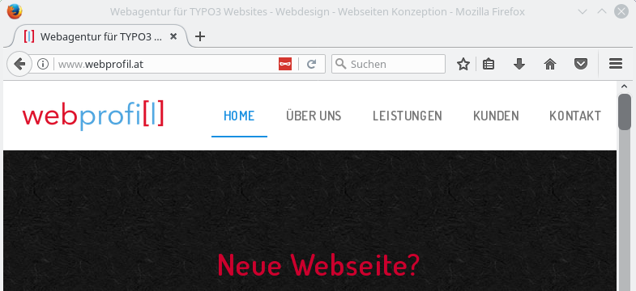

# Mask Detector

<small>by [webprofil.at](http://www.webprofil.at/)</small>

Detect websites using TYPO3 and the [Mask TYPO3 extension](https://github.com/Gernott/mask).

Source and Issue Tracker: https://github.com/Findus23/mask-detector

Licensed under [GNU General Public License v3.0](https://github.com/Findus23/mask-detector/blob/master/LICENSE)

